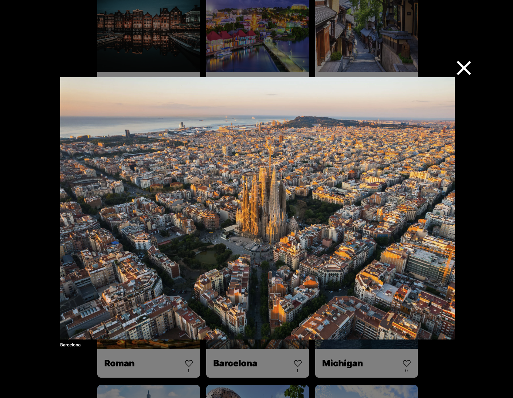
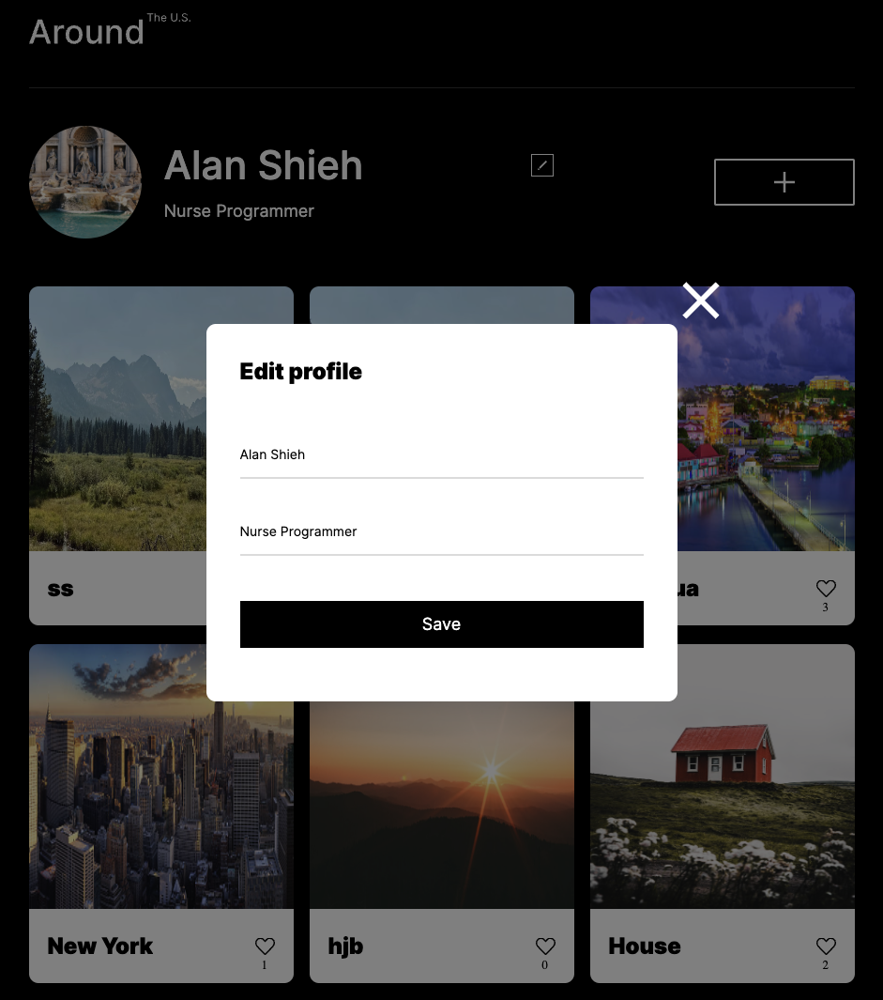
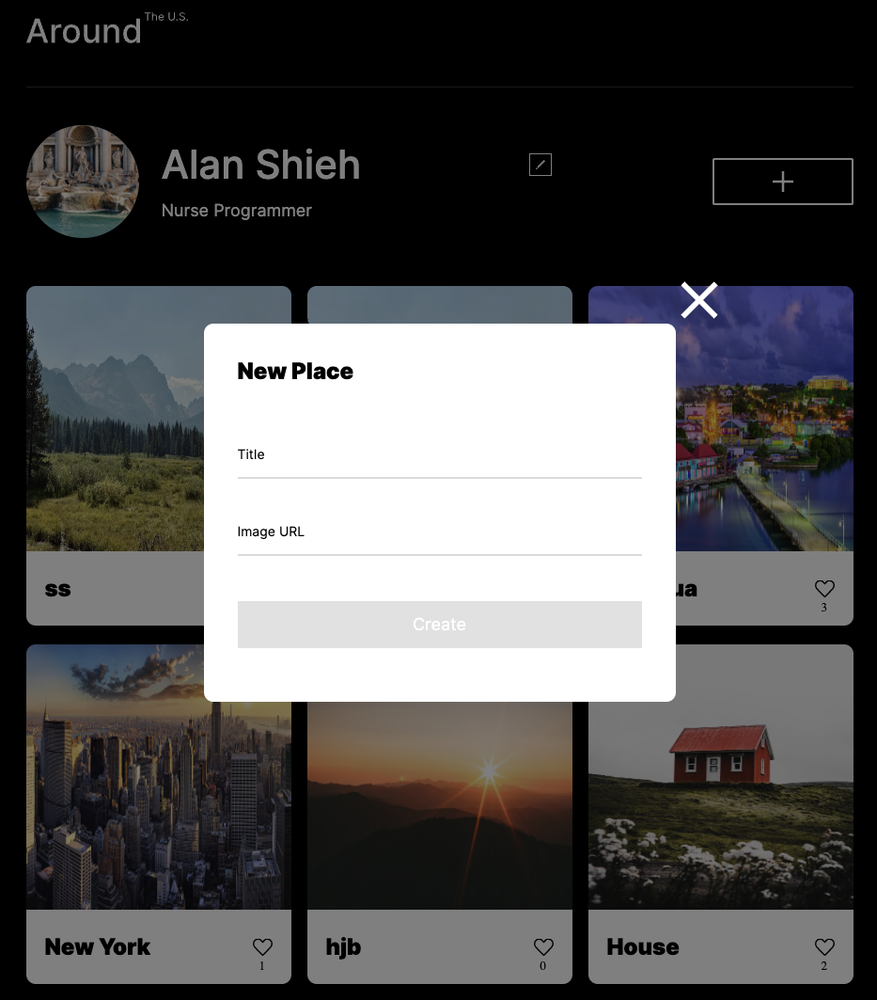

<<<<<<< HEAD
# Around The U.S.

## About the project

The Around the US website is a gallery website that uses one of Practicum's databases. Multiple students have access to the same database with a unique API key. You can only delete the images that you have added to the site.

**Technologies:** HTML • CSS • Figma • BEM • JavaScript • Git • JSON • Webpack • GitHub • Fetch API
=======
# Project: Around The U.S.

### Overview  

A functional HTML and CSS website that is responsive to various screen resolutions.

### Technology

Created using a design brief in Figma and using Visual Studio Code.
>>>>>>> e07223d1c9a23b02bdda32787a6577555102b67a

| Key features                                               |
| ---------------------------------------------------------- |
| Images are loaded from a remote server using the Fetch API |
| API authentication is required to delete images            |
| All profile info is stored in an external database         |

**Links**

- [Figma Design](https://www.figma.com/file/ii4xxsJ0ghevUOcssTlHZv/Sprint-3%3A-Around-the-US?node-id=0%3A1)
- [Project Live](https://aroundus.surge.sh/)

## Screenshots

Place Modal

Edit Profile Modal

New Place Modal

**Created By [Alan Shieh](https://github.com/piratejing)**
